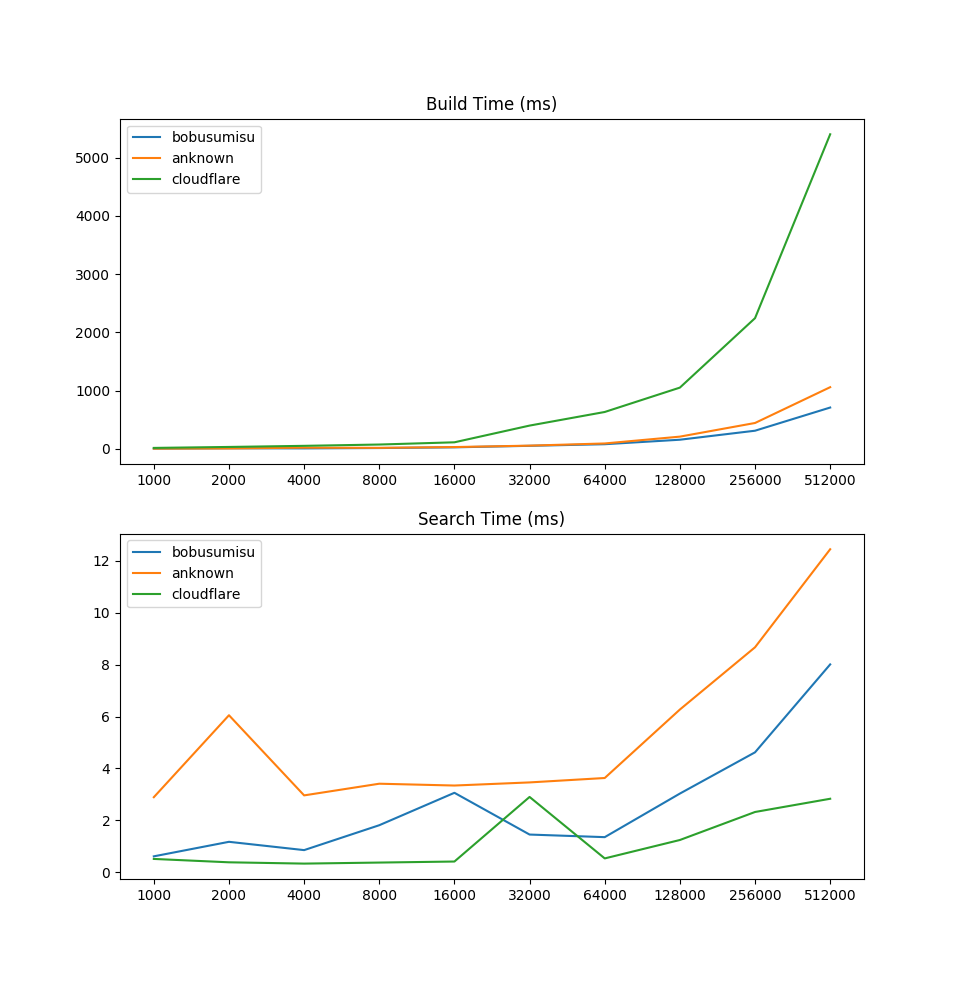

# Aho-Corasick

[](https://travis-ci.com/BobuSumisu/aho-corasick)

Implementation of the Aho-Corasick string-search algorithm in Go.

Licensed under MIT License.

## Details

This implementation does not use a [Double-Array Trie](https://linux.thai.net/~thep/datrie/datrie.html) as in my
[implementation](https://github.com/BobuSumisu/go-ahocorasick) from a couple of years back.

This reduces the build time drastically, but at the cost of higher memory consumption.

The search time is still fast, and comparable to other Go implementations I have found on github that claims to be fast
(see [performance](#Performance)).

## Documentation

Can be found at [godoc.org](https://godoc.org/github.com/BobuSumisu/aho-corasick).

## Example Usage

Use a `TrieBuilder` to build a `Trie`:

```go
trie := NewTrieBuilder().
    AddStrings([]string{"or", "amet"}).
    Build()
```

Then go and match something interesting:

```go
matches := trie.MatchString("Lorem ipsum dolor sit amet, consectetur adipiscing elit.")
fmt.Printf("Got %d matches.\n", len(matches))

// => Got 3 matches.
```

What did we match?

```go
for _, match := range matches {
    fmt.Printf("Matched %q at position %d.\n", match.Match(), match.Pos())
}

// => Matched "or" at position 1.
// => Matched "or" at position 15.
// => Matched "amet" at position 22.
```

## Building

You can easily load patterns from file:

```go
builder := NewTrieBuilder()
builder.LoadPatterns("patterns.txt")
builder.LoadStrings("strings.txt")
```

Both functions expects a text file with one pattern per line. `LoadPatterns` expects the pattern to
be in hexadecimal form.

## Performance

Some simple benchmarking on my machine (Intel(R) Core(TM) i7-8750H CPU @ 2.20GHz, 32 GiB RAM).

Build and search time grows quite linearly with regards to number of patterns and input text length.

### Building

    BenchmarkTrieBuild/100-12                    10000              0.1460 ms/op
    BenchmarkTrieBuild/1000-12                    1000              2.1643 ms/op
    BenchmarkTrieBuild/10000-12                    100             14.3305 ms/op
    BenchmarkTrieBuild/100000-12                    10            131.2442 ms/op

### Searching

    BenchmarkMatchIbsen/100-12                 2000000              0.0006 ms/op
    BenchmarkMatchIbsen/1000-12                 300000              0.0042 ms/op
    BenchmarkMatchIbsen/10000-12                 30000              0.0436 ms/op
    BenchmarkMatchIbsen/100000-12                 3000              0.4310 ms/op

### Compared to Others

Inspired by [anknown](https://github.com/anknown/ahocorasick) I also wanted to check how my implementation compared
to other Aho-Corasick implementations in Go.

I created a simple [benchmark](./benchmark/main.go) and ran it on my laptop. With 512,000 patterns, my implementation
has comparable build time and faster search time than the other implementations:

    anknown         512000     932.57ms    10.81ms      94000
    bobusumisu      512000     631.77ms     7.20ms      94000
    cloudflare      512000    4879.41ms     2.77ms       4490
    iohub           512000     393.96ms    14.19ms      91986

[cloudflare](https://github.com/cloudflare/ahocorasick) is implemented a bit differently though. It doesn't output
position of matches but returns indices into the original patterns array.



### Memory Usage

As mentioned, the memory consumption will be quite high compared to a double-array trie
implementation. Especially during the build phase (which currently contains a lot of object
allocations).
